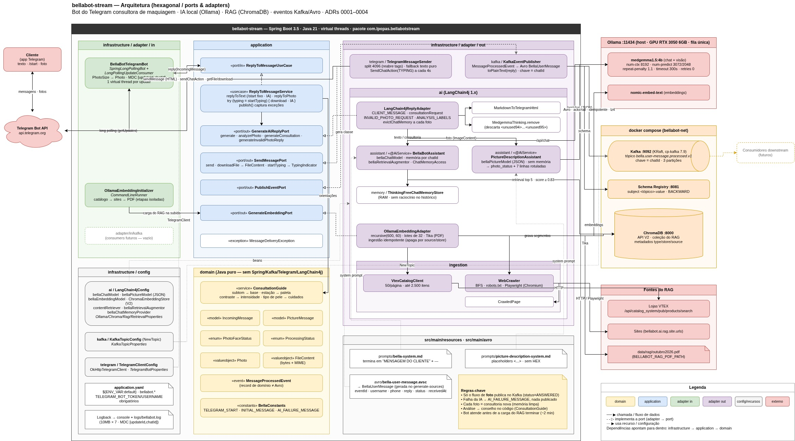
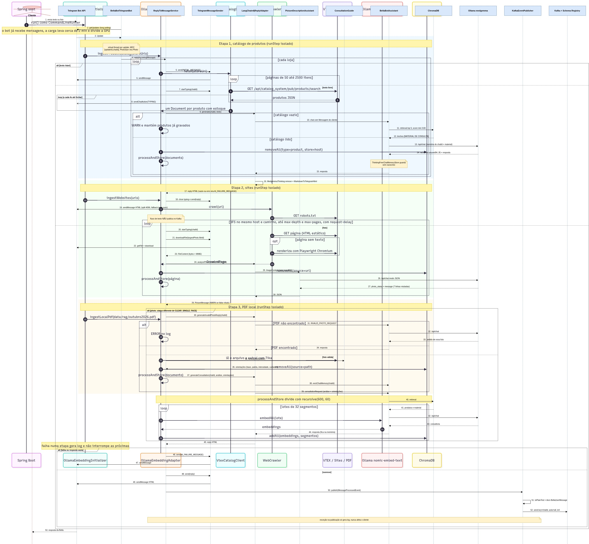
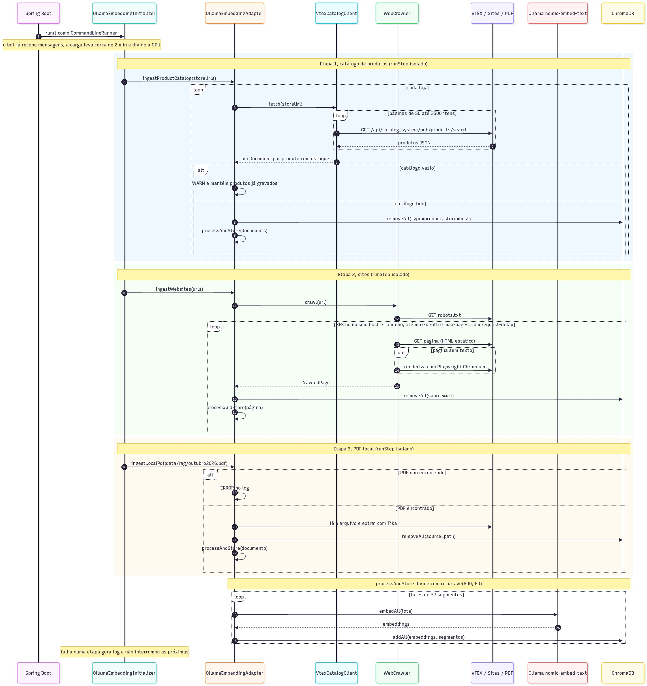

# bellabot-stream

A **Bella** é uma consultora virtual de maquiagem e cuidados com a pele, com foco em produtos Mary Kay, que atende pelo **Telegram**:

- **Texto:** responde dúvidas com apoio de uma base de conhecimento (RAG) com o catálogo da loja, artigos sobre pele e um PDF de campanha.
- **Foto do rosto:** analisa tom, subtom, tipo de pele, contraste e estação de cores, e monta uma consultoria com cuidados, maquiagem e produtos.

Toda a IA roda **localmente** (Ollama), e as fotos não saem da máquina. As consultorias de foto concluídas com sucesso são publicadas no Kafka (Avro).

---

## Stack

| Área | Tecnologia | Versão |
|---|---|---|
| Runtime | Java (virtual threads) | 21 |
| Framework | Spring Boot | 3.5.16 |
| Telegram | `telegrambots` (long polling + `OkHttpTelegramClient`) | 10.3.0 |
| IA | LangChain4j + `langchain4j-ollama` (sem starter) | 1.20.2 |
| Modelos | `medgemma1.5:4b` (chat e visão), `nomic-embed-text` (embeddings) | Ollama 0.34+ |
| Vetores | ChromaDB (API v2) | 1.5.9 |
| Mensageria | Kafka (KRaft) + Confluent Schema Registry + Avro | 7.9.10 / Avro 1.11.5 |
| Ingestão | jsoup, Playwright (páginas com JS), Apache Tika (PDF) | — |
| Utilitários | Lombok | — |

---

## Como subir o projeto

### 1. Pré-requisitos

| Item | Como verificar | Observação |
|---|---|---|
| JDK 21 | `java -version` | Use o `./mvnw` do projeto, não o Maven do sistema |
| Docker + Docker Compose | `docker compose version` | O seu usuário precisa ter acesso ao Docker (veja abaixo) |
| Ollama 0.34+ | `ollama --version` | Roda fora do Docker, como serviço da máquina |
| GPU NVIDIA com 6 GB ou mais (recomendado) | `nvidia-smi` | Sem GPU funciona, mas uma consultoria pode levar vários minutos |
| Um bot do Telegram | — | Criado no @BotFather (passo 2) |

Se o `docker` responder com "permission denied", adicione o seu usuário ao grupo `docker` e abra uma nova sessão:
```bash
sudo usermod -aG docker $USER
```

### 2. Criar o bot no Telegram
1. No Telegram, abra uma conversa com o **@BotFather** e envie `/newbot`.
2. Escolha um nome e um username terminado em `bot`.
3. Guarde o **token** e o **username** que o BotFather devolver.

> Nunca coloque o token em arquivos do projeto, nem como valor padrão no `application.yaml`. Passe-o só por variável de ambiente. Se um token vazar, gere outro no @BotFather com `/revoke`.

### 3. Subir a infraestrutura (Kafka, Schema Registry e ChromaDB)
```bash
docker compose up -d
docker compose ps        # aguarde os três serviços aparecerem como "healthy"
```

Para conferir:
```bash
curl -s localhost:8081/subjects              # Schema Registry: responde []
curl -s localhost:8000/api/v2/heartbeat      # ChromaDB: responde {"nanosecond heartbeat": ...}
```

### 4. Preparar o Ollama e os modelos
```bash
ollama serve                    # se ainda não estiver rodando como serviço (systemctl status ollama)
ollama pull medgemma1.5:4b      # cerca de 3 GB
ollama pull nomic-embed-text
curl -s localhost:11434/api/tags   # os dois modelos devem aparecer
```

Depois da primeira resposta do bot, confira se o modelo está na GPU:
```bash
curl -s localhost:11434/api/ps     # "size_vram" maior que 0 indica GPU; 0 indica CPU
```

### 5. Conferir o PDF do RAG
A carga do RAG lê `data/rag/outubro2026.pdf`, um caminho relativo à pasta de onde a aplicação é executada. Para usar outro arquivo, defina `BELLABOT_RAG_PDF_PATH` (ex.: `file:/caminho/arquivo.pdf`). Se o arquivo não existir, essa etapa só registra um erro e as outras seguem normalmente.

### 6. Rodar a aplicação
Pelo terminal, **a partir da raiz do projeto**:
```bash
export TELEGRAM_BOT_TOKEN='<token do BotFather>'
export TELEGRAM_BOT_USERNAME='<username do bot, sem @>'

./mvnw clean compile          # também gera as classes Avro
./mvnw spring-boot:run
```

Pelo **IntelliJ**:
1. Execute a classe `BellabotStreamApplication`.
2. Na configuração de execução, defina as duas variáveis em *Environment variables*.
3. Deixe o *Working directory* na raiz do projeto.

### 7. Verificar se subiu
Os logs saem no console e em `logs/bellabot.log`:
```bash
tail -F logs/bellabot.log
```

Na subida, aparecem nesta ordem:
1. `Bot @<username> registrado e escutando mensagens (long polling)`: o bot já está atendendo.
2. `=== Iniciando Carga Automática de Dados RAG ===`
3. `Catálogo de loja.marykay.com.br ingerido: N produtos`, `Carga RAG: sites concluído…` e `Carga RAG: PDF concluído…`
4. `=== Carga Automática Concluída em … ms ===`, cerca de 2 minutos depois.

Teste no Telegram:
1. Envie `/start` ao bot: ele responde a mensagem inicial.
2. Envie uma pergunta, como "que base é boa para pele oleosa?".
3. Envie uma **foto do rosto**, de frente e com boa luz. O "digitando..." fica visível enquanto a IA trabalha. Na tomada, a resposta leva cerca de 1 minuto.

Para ver o evento publicado no Kafka depois de uma foto:
```bash
docker exec bellabot-schema-registry kafka-avro-console-consumer \
  --bootstrap-server kafka:29092 --topic bella.user-message.processed.v1 \
  --from-beginning --property schema.registry.url=http://localhost:8081
```

### 8. Parar
Pare a aplicação com `Ctrl+C` e depois a infraestrutura:
```bash
docker compose down          # mantém os dados; com -v, apaga os volumes do Kafka e do Chroma
```

### Problemas comuns

| Sintoma | Causa provável | Solução |
|---|---|---|
| Aplicação não sobe: `Could not resolve placeholder 'TELEGRAM_BOT_USERNAME'` | Variáveis do Telegram não definidas | Defina `TELEGRAM_BOT_TOKEN` e `TELEGRAM_BOT_USERNAME` (passo 6) |
| Log com `Error received from Telegram GetUpdates` em loop | Outra instância (ou o `contextLoads`) usa o mesmo token | Deixe só uma instância rodando |
| Resposta padrão "Desculpe, não consegui processar…" e `TimeoutException` no log | GPU lenta: notebook na bateria ou em `power-saver` | Ligue na tomada, ou rode `powerprofilesctl set performance`; confira com `nvidia-smi` |
| Tudo muito lento depois de o notebook suspender | O CUDA falhou e o Ollama passou para a CPU (`size_vram: 0`) | `sudo systemctl restart ollama` |
| `Arquivo PDF não foi localizado` | Executado fora da raiz do projeto | Rode da raiz ou defina `BELLABOT_RAG_PDF_PATH` |
| Respostas sem produtos logo após subir | A carga do RAG ainda não terminou | Aguarde `Carga Automática Concluída` |
| Páginas do crawler sem texto ou erro do Playwright | Faltam bibliotecas do sistema para o Chromium | `./mvnw exec:java -Dexec.mainClass=com.microsoft.playwright.CLI -Dexec.args="install-deps chromium"` (pede sudo) |
| `permission denied ... docker.sock` | Usuário sem acesso ao Docker | `sudo usermod -aG docker $USER` e nova sessão |

---

## Prompt para subir o projeto com qualquer LLM

Copie o texto abaixo para um assistente de IA com acesso ao terminal (Claude Code, Cursor, Copilot Agent etc.), aberto na raiz do repositório:

````text
Você vai preparar e subir o projeto `bellabot-stream` nesta máquina. Ele é um bot do Telegram em Java 21 / Spring Boot 3.5 que usa Ollama (IA local), ChromaDB, Kafka e Schema Registry. Trabalhe na raiz do repositório e siga as etapas em ordem. Em cada etapa, rode a verificação indicada antes de seguir. Se uma verificação falhar, diagnostique e me explique antes de tentar outra abordagem.

Regras:
- Leia primeiro o README.md e o CLAUDE.md do projeto. Eles têm prioridade sobre suposições suas.
- Use sempre o `./mvnw`, nunca o `mvn` do sistema.
- NÃO grave o token do Telegram em nenhum arquivo do projeto (nem no application.yaml, nem no .env versionado). Peça o token e o username a mim e use-os só como variáveis de ambiente da sessão.
- NÃO rode comandos com sudo, nem instale pacotes do sistema, sem me pedir confirmação antes.
- NÃO altere código-fonte, prompts (src/main/resources/prompts) nem o application.yaml. A tarefa é só subir o projeto.
- Não apague volumes do Docker nem dados do ChromaDB.

Etapas:
1. Pré-requisitos: verifique `java -version` (precisa ser 21), `docker compose version`, `ollama --version` e `nvidia-smi` (este último é opcional; sem GPU funciona, mas fica lento). Se o Docker der "permission denied", pare e me peça para adicionar o usuário ao grupo docker.
2. Infraestrutura: rode `docker compose up -d` e aguarde `docker compose ps` mostrar kafka, schema-registry e chromadb como healthy. Verifique com `curl -s localhost:8081/subjects` e `curl -s localhost:8000/api/v2/heartbeat`.
3. Ollama: confirme que responde em `curl -s localhost:11434/api/tags`. Se `medgemma1.5:4b` ou `nomic-embed-text` não estiverem na lista, rode `ollama pull` de cada um.
4. PDF do RAG: confirme que `data/rag/outubro2026.pdf` existe. Se não existir, me avise (a aplicação sobe assim mesmo, sem o PDF no RAG).
5. Credenciais: peça-me o TELEGRAM_BOT_TOKEN e o TELEGRAM_BOT_USERNAME (sem @). Exporte-os só no ambiente do processo da aplicação.
6. Build e testes: rode `./mvnw clean compile` e depois `./mvnw test`. Os testes não dependem da infraestrutura; o `contextLoads` fica pulado sem BELLABOT_IT=true. Se algo falhar, mostre o erro e pare.
7. Execução: suba com `./mvnw spring-boot:run`, a partir da raiz, em segundo plano. Acompanhe `logs/bellabot.log` até ver "Bot @... registrado e escutando mensagens" e, depois, "=== Carga Automática Concluída em ... ms ===" (cerca de 2 minutos).
8. Verificação final: confira se há linhas ERROR no log com `grep -E ' (ERROR|WARN) ' logs/bellabot.log`. Explique cada uma, se houver. Depois me peça para enviar /start e uma foto do rosto ao bot, e acompanhe o log. Depois da primeira resposta, rode `curl -s localhost:11434/api/ps` e diga se o modelo está na GPU (`size_vram` maior que 0) ou na CPU.

Ao terminar, mostre um resumo: o que subiu, as portas (Kafka 9092, Schema Registry 8081, ChromaDB 8000, Ollama 11434), o tempo da carga do RAG, a presença ou ausência de avisos e como parar tudo (Ctrl+C na aplicação e `docker compose down`).
````

---

## Arquitetura

O projeto segue a arquitetura **hexagonal** ([ADR 0002](docs/adr/0002-arquitetura-hexagonal.md)), com as dependências apontando para dentro:

```
infrastructure  →  application  →  domain
```

```
com.lpopas.bellabotstream
├── domain/                 Java puro: IncomingMessage, PictureMessage, Photo, FileContent, MessageProcessedEvent,
│   │                       BellaConstants (/start, mensagem inicial, mensagem de falha)
│   └── service/            ConsultationGuide (análise facial → base, cores, intensidade, cuidados)
├── application/
│   ├── port/in/            ReplyToMessageUseCase
│   ├── port/out/           GenerateAiReplyPort (generate, analyzePhoto, generateConsultation, generateInvalidPhotoReply),
│   │                       SendMessagePort (send, downloadFile → FileContent, startTyping), GenerateEmbeddingPort, PublishEventPort
│   └── usecase/            ReplyToMessageService
└── infrastructure/
    ├── config/{ai,kafka,telegram}       beans e @ConfigurationProperties
    ├── adapter/in/telegram              BellaBotTelegramBot (long polling, 1 virtual thread por update)
    ├── adapter/in/ai                    OllamaEmbeddingInitializer (carga do RAG na subida)
    ├── adapter/out/ai                   LangChain4jReplyAdapter (monta os pedidos à LLM), OllamaEmbeddingAdapter,
    │                                    MarkdownToTelegramHtml, MedgemmaThinking (remove o raciocínio),
    │                                    assistant/ (BellaBotAssistant, PictureDescriptionAssistant),
    │                                    memory/ (ThinkingFreeChatMemoryStore), ingestion/ (VtexCatalogClient, WebCrawler)
    ├── adapter/out/telegram             TelegramMessageSender
    └── adapter/out/kafka                KafkaEventPublisher
```

### Diagramas

Ficam em [`docs/architecture/`](docs/architecture/). Os arquivos `.drawio` abrem no [draw.io](https://app.diagrams.net) (web, desktop ou extensão do VS Code).

| Diagrama | Editável | Fonte Mermaid | Imagem |
|---|---|---|---|
| Arquitetura (camadas, ports, adapters e infraestrutura) | [`arquitetura.drawio`](docs/architecture/arquitetura.drawio) | — | [`diagrama-bellabot-stream.jpg`](docs/architecture/diagrama-bellabot-stream.jpg) |
| Sequência do fluxo de mensagens (`/start`, texto e foto) | [`sequencia-fluxo-mensagens.drawio`](docs/architecture/sequencia-fluxo-mensagens.drawio) | [`sequencia-fluxo-mensagens.mmd`](docs/architecture/sequencia-fluxo-mensagens.mmd) | [`sequencia-fluxo-mensagens.jpg`](docs/architecture/sequencia-fluxo-mensagens.jpg) |
| Sequência da carga do RAG | [`sequencia-carga-rag.drawio`](docs/architecture/sequencia-carga-rag.drawio) | [`sequencia-carga-rag.mmd`](docs/architecture/sequencia-carga-rag.mmd) | [`diagrama-sequencia-bellabot-stream.jpg`](docs/architecture/diagrama-sequencia-bellabot-stream.jpg) |







### Decisões (ADRs)

As decisões estão registradas em [`docs/adr/`](docs/adr/README.md):

| ADR | Decisão |
|---|---|
| [0001](docs/adr/0001-pipeline-de-ia-local-com-dois-agentes-e-regras-no-dominio.md) | Pipeline de IA local com dois agentes e regras de consultoria no domínio |
| [0002](docs/adr/0002-arquitetura-hexagonal.md) | Arquitetura hexagonal |
| [0003](docs/adr/0003-kafka-avro-eventos-de-sucesso.md) | Kafka com Avro, publicando só mensagens processadas com sucesso |
| [0004](docs/adr/0004-carga-do-rag-na-subida-com-ingestao-idempotente.md) | Carga do RAG na subida, com ingestão idempotente |

---

## Fluxos

### Mensagem de texto
```
Telegram → BellaBotTelegramBot (virtual thread, MDC updateId/chatId)
        → ReplyToMessageService
            ├─ "/start" → mensagem inicial fixa (sem IA)
            └─ "digitando..." → BellaBotAssistant
                   mensagem marcada como `Mensagem do cliente: "…"` + bella-system.md
                   + memória por chatId (guardada sem o raciocínio) + RAG [MATERIAL DE CONSULTA] (score ≥ 0,83)
        → MedgemmaThinking.remove (descarta o raciocínio <unused94>…<unused95>) → Markdown → HTML do Telegram
        → TelegramMessageSender (divide acima de 4096 caracteres em ponto natural, equilibrando as tags)
```

### Foto do rosto (dois agentes, [ADR 0001](docs/adr/0001-pipeline-de-ia-local-com-dois-agentes-e-regras-no-dominio.md))
```
Telegram → maior resolução da foto → download → FileContent (bytes + MIME)    ("digitando..." ativo)
        → PictureDescriptionAssistant (modo JSON) → photo_status + 7 linhas rotuladas:
              Tom de pele / Subtom / Tipo de pele / Contraste / Estação provável / Cores observadas / Limitações
        → foto inválida → a Bella pede uma nova foto
        → foto válida   → ConsultationGuide (código) calcula base, cores, intensidade e cuidados
                         → memória do chat limpa (cada foto é uma consultoria nova)
                         → BellaBotAssistant redige a consultoria (análise + orientações + RAG)
        → Telegram → evento no Kafka (bella.user-message.processed.v1)
```

Nos dois fluxos, uma falha da IA ou uma resposta vazia faz o usuário receber a mensagem padrão de falha, e nada é publicado.

### Carga do RAG (na subida, [ADR 0004](docs/adr/0004-carga-do-rag-na-subida-com-ingestao-idempotente.md))
Três etapas isoladas; a falha de uma não impede as outras:
1. **Catálogo VTEX** (`bellabot.ai.rag.catalog.store-urls`): um documento por produto em estoque. O catálogo é lido inteiro antes de apagar os produtos antigos da loja.
2. **Sites** (`bellabot.ai.rag.site.urls`): busca em largura no mesmo host e caminho, respeitando o `robots.txt`, a profundidade e o limite de páginas. Usa Playwright quando o HTML estático vem sem texto.
3. **PDF** (`data/rag/outubro2026.pdf`): extração com Tika.

Cada fonte substitui o que gravou na subida anterior (remoção por metadado). Os documentos são divididos em segmentos de 600 caracteres (sobreposição de 60), e os embeddings são gerados em lotes de 32.

### Kafka ([ADR 0003](docs/adr/0003-kafka-avro-eventos-de-sucesso.md))
- **Contrato:** o schema `src/main/avro/bella-user-message.avsc` gera `BellaUserMessage` (`eventId`, `username`, `phone`, `reply`, `status`, `receivedAt`).
- **Publicação:** no tópico `bella.user-message.processed.v1`, com chave = chatId. Só o fluxo de foto publica, e só depois de a IA responder e a mensagem ser entregue.
- **Conteúdo:** o `reply` vai como texto puro.
- **Garantias:** producer idempotente com `acks=all` e lz4; compatibilidade `BACKWARD` no registry.

---

## Testes
```bash
./mvnw test
./mvnw test -Dtest=ReplyToMessageServiceTest
./mvnw test -Dtest=ReplyToMessageServiceTest#shouldShowTypingWhileAiGeneratesAndStopBeforeSending
BELLABOT_IT=true ./mvnw test -Dtest=BellabotStreamApplicationTests   # exige infraestrutura e credenciais
```

| Teste | Cobertura |
|---|---|
| `ReplyToMessageServiceTest` | Fluxos de texto e foto, "digitando...", publicação só em caso de sucesso, montagem do pedido à Bella |
| `ConsultationGuideTest` | Subtom → base, estação → paleta, contraste → intensidade, tipo de pele → cuidados |
| `LangChain4jReplyAdapterTest` | Remoção do raciocínio, extração do JSON, validação dos rótulos da análise, montagem dos pedidos à Bella, marcação da mensagem do cliente, limpeza da memória antes da consultoria |
| `ThinkingFreeChatMemoryStoreTest` | Memória da conversa guardada sem o raciocínio do modelo |
| `LangChain4jConfigTest` | Bloco `[MATERIAL DE CONSULTA]` do RAG |
| `MarkdownToTelegramHtmlTest` | Conversão Markdown → HTML do Telegram |
| `TelegramMessageSenderTest` | Divisão de mensagens com tags equilibradas, "digitando...", tipo MIME pela extensão do arquivo |
| `KafkaEventPublisherTest` | Mapeamento para Avro e conversão do `reply` para texto puro |
| `WebCrawlerTest`, `VtexCatalogClientTest` | Ingestão (robots.txt, links, fixture da VTEX) |
| `BellabotStreamApplicationTests` | `contextLoads`, só com `BELLABOT_IT=true` |

---

## Configuração

Todas as propriedades seguem o padrão `${ENV_VAR:default}` no `application.yaml`.

| Variável | Default | Uso |
|---|---|---|
| `TELEGRAM_BOT_TOKEN` / `TELEGRAM_BOT_USERNAME` | — (obrigatórias) | Credenciais do bot |
| `OLLAMA_BASE_URL` | `http://localhost:11434` | Servidor Ollama |
| `OLLAMA_CHAT_MODEL` | `medgemma1.5:4b` | Modelo de chat e visão |
| `OLLAMA_EMBEDDING_MODEL` | `nomic-embed-text` | Modelo de embeddings |
| `OLLAMA_TIMEOUT` | `300s` | Timeout por chamada |
| `OLLAMA_NUM_CTX` | `8192` | Janela de contexto |
| `OLLAMA_NUM_PREDICT` | `3072` | Teto de tokens da Bella (o medgemma raciocina ~2.000–2.800 tokens antes de responder) |
| `OLLAMA_PICTURE_NUM_PREDICT` | `2048` | Teto de tokens da análise de foto (modo JSON) |
| `OLLAMA_REPEAT_PENALTY` | `1.1` | Penalidade de repetição |
| `OLLAMA_TEMPERATURE` | `0.3` | Temperatura |
| `OLLAMA_CHAT_MAX_RETRIES` | `0` | Retries do chat (repetir após timeout só multiplica a espera) |
| `OLLAMA_MAX_RETRIES` | `2` | Retries dos embeddings |
| `BELLABOT_CHAT_MEMORY_MAX_MESSAGES` | `20` | Janela de memória por chat |
| `BELLABOT_RAG_MAX_RESULTS` / `BELLABOT_RAG_MIN_SCORE` | `5` / `0.83` | Busca no RAG (o nomic sem prefixos comprime os scores: saudações ≤ 0,82, perguntas reais ≥ 0,84) |
| `CHROMA_BASE_URL` / `CHROMA_COLLECTION` | `http://localhost:8000` / `bellabot` | Vector store |
| `BELLABOT_RAG_SITE_URLS` | `https://www.sbd.org.br/cuidados/` | Sites indexados (separados por vírgula) |
| `BELLABOT_RAG_SITE_MAX_DEPTH` / `_MAX_PAGES` / `_REQUEST_DELAY` | `2` / `50` / `1s` | Limites do crawler |
| `BELLABOT_RAG_CATALOG_STORE_URLS` | `https://loja.marykay.com.br` | Lojas VTEX indexadas |
| `BELLABOT_RAG_PDF_PATH` | `file:data/rag/outubro2026.pdf` | PDF indexado (relativo ao diretório de execução) |
| `KAFKA_BOOTSTRAP_SERVERS` / `SCHEMA_REGISTRY_URL` | `localhost:9092` / `http://localhost:8081` | Kafka |
| `BELLABOT_TOPIC_USER_MESSAGE` | `bella.user-message.processed.v1` | Tópico de eventos |
| `LOG_FILE` | `logs/bellabot.log` | Arquivo de log (rotação de 10MB, 7 arquivos) |

**Desempenho:** numa RTX 3050 6GB na tomada, o modelo gera ~48 tokens/s e uma consultoria por foto leva ~1 minuto. Na bateria em `power-saver`, a GPU cai para 20W (~5 tokens/s) e as respostas estouram o timeout.

---

## Análise do projeto

### Pontos fortes
- **IA local e privada:** as fotos não saem da máquina, e não há custo por chamada.
- **Regras críticas no código:** base, cores e cuidados são calculados pelo `ConsultationGuide` e testados. Com essas regras numa tabela do prompt, o modelo errava de 20% a 30% das vezes; com o guia no código, acertou 6 de 6.
- **Contrato observável entre os agentes:** a análise tem 7 linhas rotuladas, e um rótulo ausente gera WARN no log.
- **Contexto sob controle:** a memória da conversa é guardada sem o raciocínio do modelo (5 a 11 mil caracteres por resposta) e é limpa a cada nova foto. Antes disso, o contexto de 8.192 tokens estourava após algumas trocas, e o modelo passou a copiar respostas antigas.
- **Camadas bem separadas:** domínio em Java puro, use cases testados sem Spring, e `./mvnw test` não depende de infraestrutura.
- **Saída robusta para o Telegram:**
  - o raciocínio do modelo é removido;
  - o Markdown vira HTML;
  - mensagens longas são divididas sem quebrar tags, com fallback para texto puro;
  - o "digitando..." fica visível durante o processamento.
- **Ingestão idempotente:** catálogo, sites e PDF não se duplicam a cada subida, e o crawler respeita o `robots.txt`.
- **Observabilidade:** os logs trazem `updateId`/`chatId` e o tempo de cada etapa.

### Problemas e riscos

| Severidade | Ponto | Situação |
|---|---|---|
| 🟠 Média | **Latência da IA** | O medgemma sempre raciocina antes de responder, e uma foto leva ~1 min na tomada. Na bateria, as respostas estouram o timeout. |
| 🟠 Média | **Bot atende antes de o RAG estar pronto** | A carga leva ~2 min depois do registro do bot e disputa a única GPU com os usuários (ADR 0004). |
| 🟠 Média | **Ollama sem GPU após suspensão** | O CUDA pode falhar e o Ollama passa para a CPU sem avisar a aplicação. Não há health check. |
| 🟡 Baixa | **Eventos sem garantia de entrega** | Não há outbox: se o broker cair na hora do envio, o evento se perde (ADR 0003). |
| 🟠 Média | **Loop de raciocínio em saudações** | Mensagens muito curtas, como "oi", às vezes fazem o modelo repetir as regras do prompt até gastar o `num-predict`, e o cliente recebe a mensagem de falha. |
| 🟡 Baixa | **Análise da foto incompleta** | O agente de foto às vezes omite a linha `Limitações:` (gera WARN; não afeta as orientações). |
| 🟡 Baixa | **Memória volátil** | `MessageWindowChatMemory` fica em memória: reiniciar apaga as conversas. |
| 🟡 Baixa | **Contato da consultora provisório** | "Fulana de Tal / 99999-8888" é um placeholder fixo no `bella-system.md`. |

### Próximos passos sugeridos
1. Responder saudações, agradecimentos e emojis com um texto fixo, sem chamar a LLM, como já acontece com o `/start`.
2. Atrasar o registro do bot até o fim da carga do RAG, ou fazer a carga em segundo plano com prioridade menor.
3. Criar um health check que detecte o modelo sem VRAM (`/api/ps`) e avise no log.
4. Mover os dados de contato da consultora para a configuração e deixar o código acrescentá-los ao fim da consultoria.
5. Persistir a memória de chat (`ChatMemoryStore`) se o histórico precisar sobreviver a reinícios.
6. Validar as regras de camada com ArchUnit e trocar o `contextLoads` por testes com Testcontainers.
